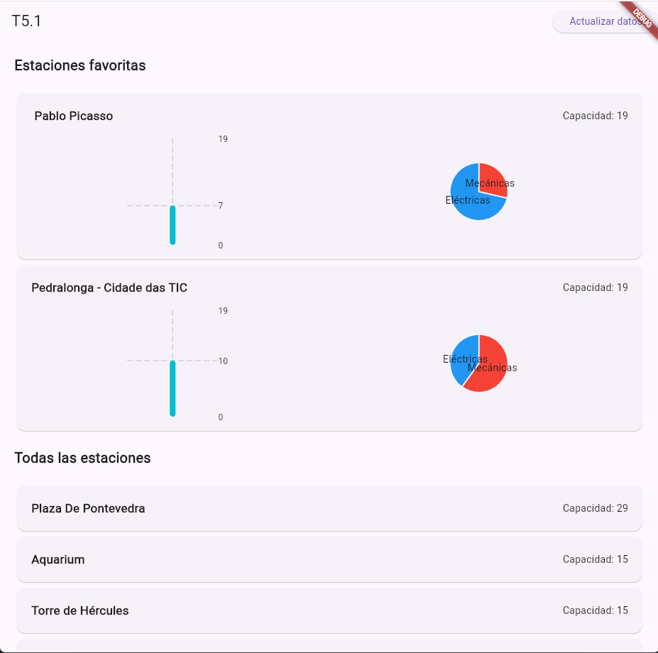
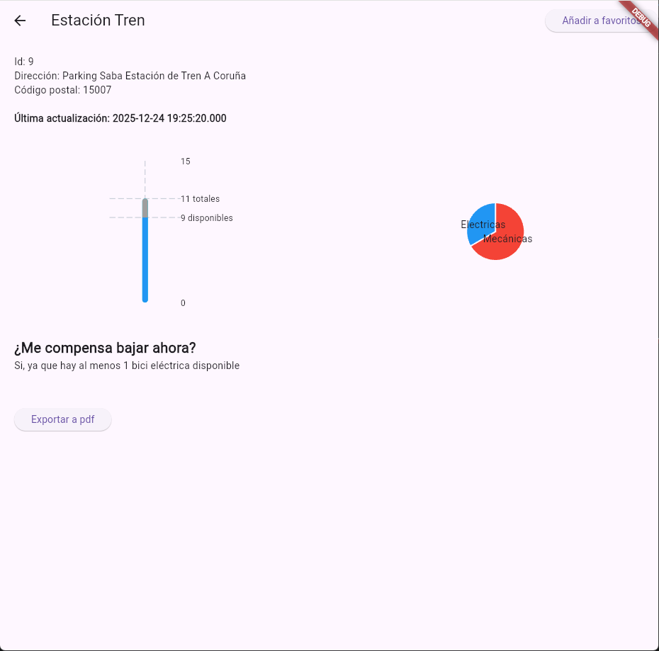
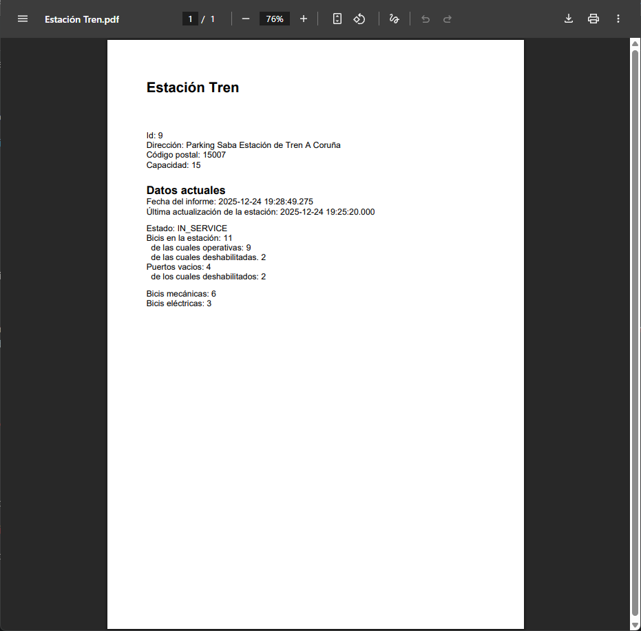

# t5_1

## Por qué este enfoque

Para la aplicación se ha elejido un enfoque simple de lista, 
en la que lo primero que aparece es lo marcado como favorito
en la aplicación ya que es un diseño muy común en aplicaciones
y facilita la información de lo que el usuario cree más importante

## Por qué estos gráficos

El gráfico de barras da una representación fácil de cuántas bicis hay en la
estación y en la página de detalles informa también de cuantas hay estropeadas.

El gráfico de tarta muestra de manera rápida cuantas bicis de cada tipo hay para que el usuario se haga rápidamente una idea de cuantas hay y cual es la mayoría.

## Dependencias usadas

fl_chart, pdf y printing